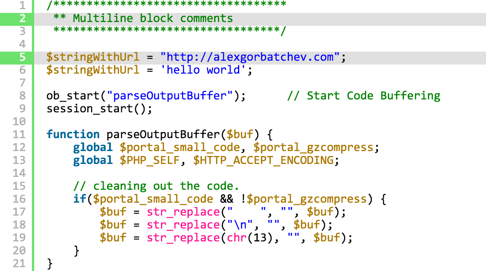
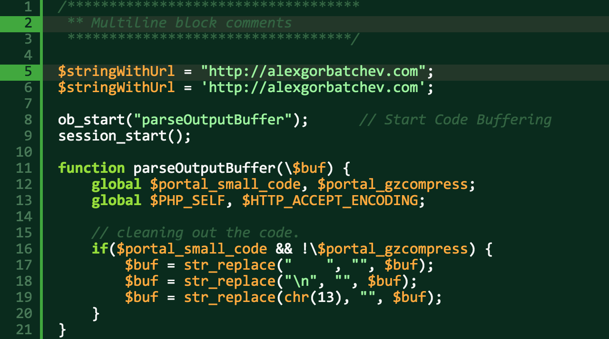
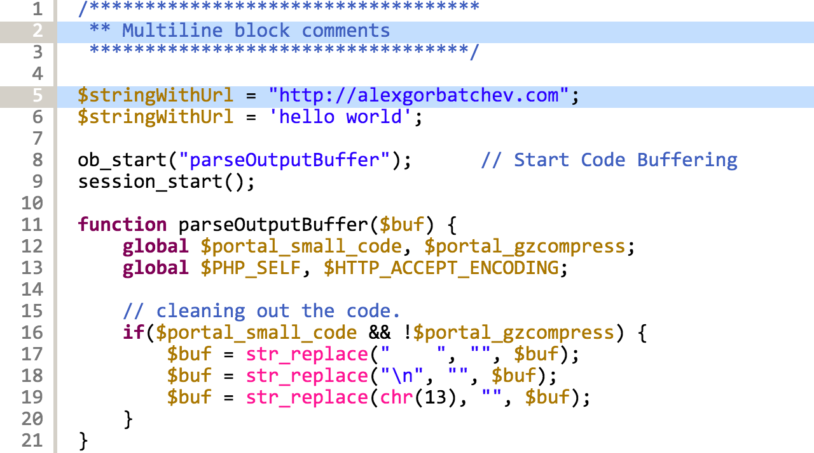
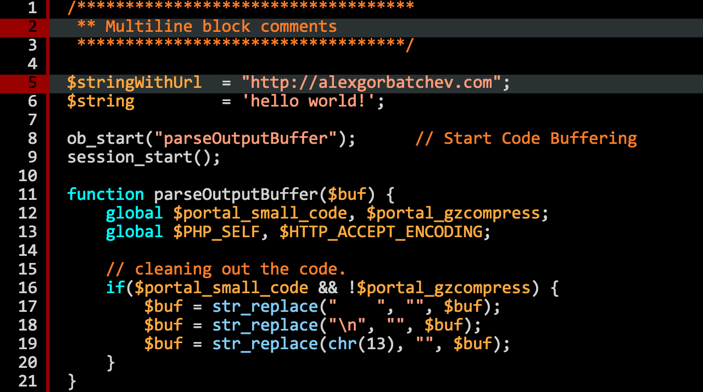
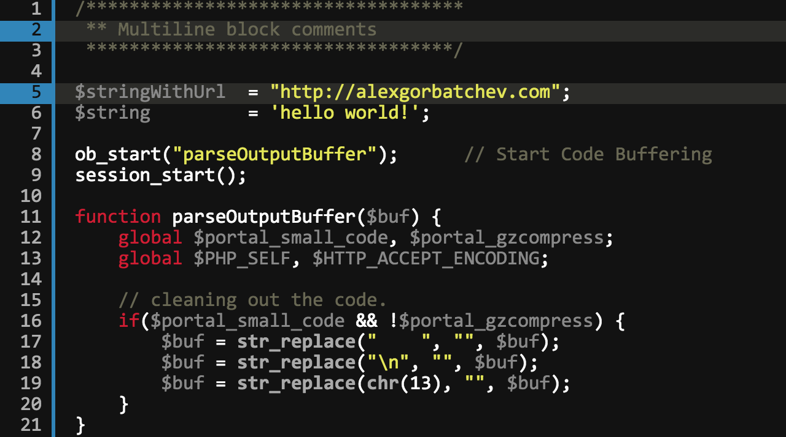
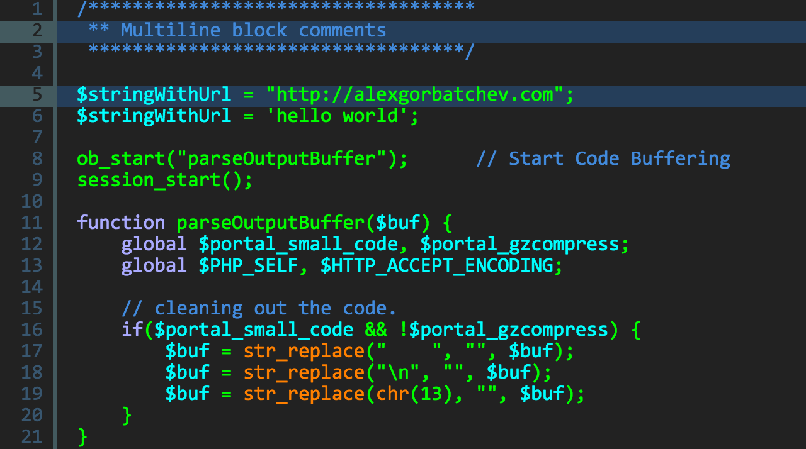
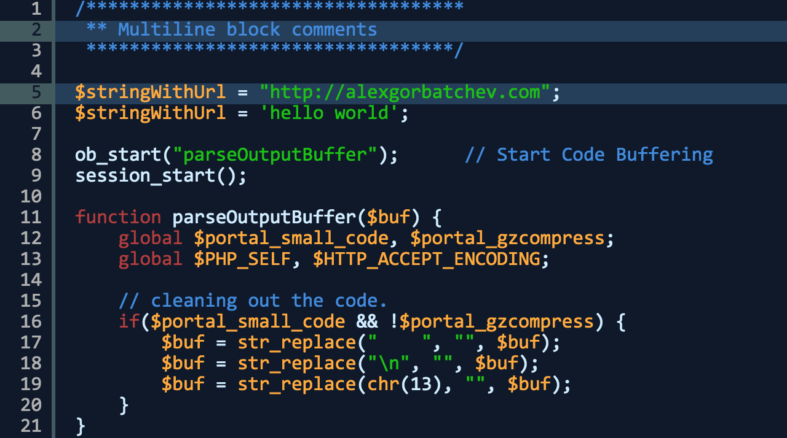
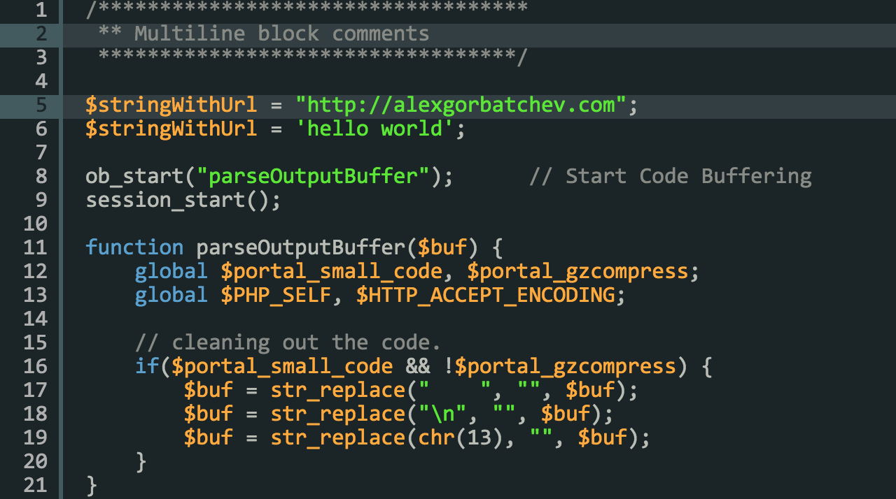
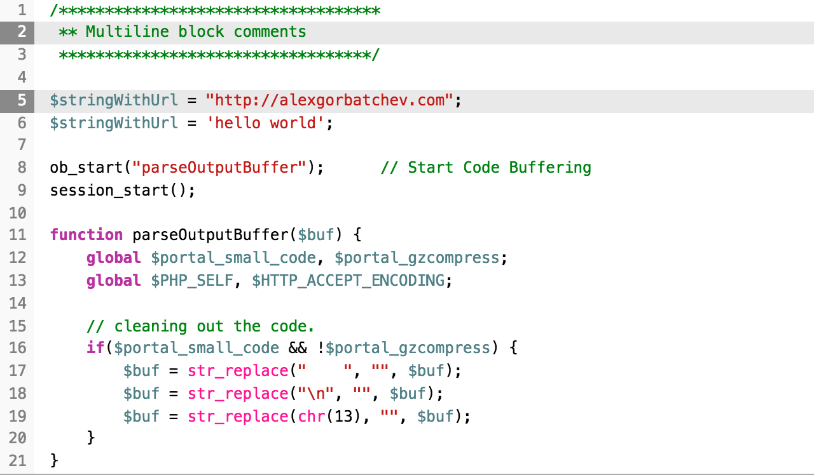

# themes

This folder contains the themes for SyntaxHighlight

## Usage

Just include a link to the theme you like to use in the top of your page:

```html
<link rel="stylesheet" type="text/css" href="path-to-syntaxhighlight/src/themes/theme-default/theme.css">
```
For the minified version if you build it or if you installed from npm
```html
<link rel="stylesheet" type="text/css" href="path-to-syntaxhighlight/dist/themes/theme-default/theme.css">
```

## List of themes
- theme-default 
- theme-django 
- theme-eclipse 
- theme-emacs 
- theme-fadetogrey 
- theme-mdultra 
- theme-midnight 
- theme-rdark 
- theme-swift 
## License

MIT
